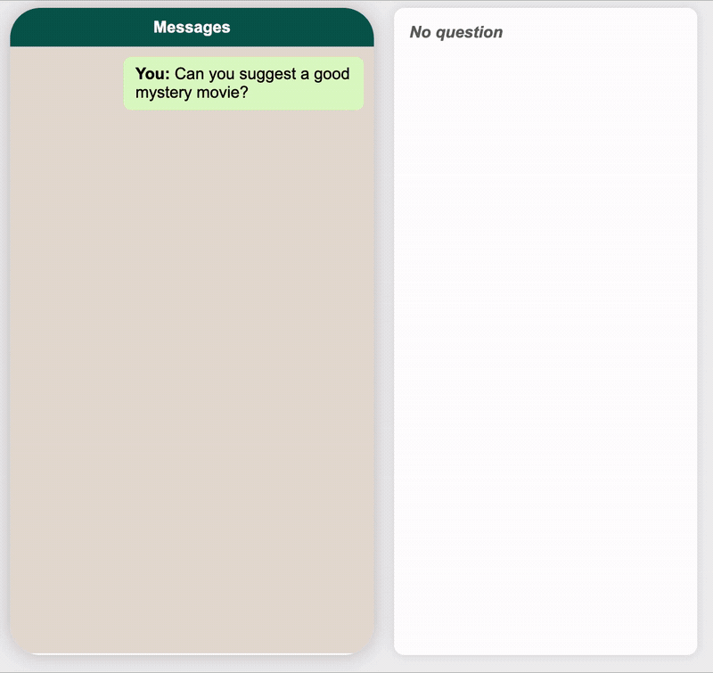

# CRSArena-Eval Annotation Interface

The **CRSArena-Eval annotation interface** is a browser-based tool for collecting human judgments of conversational systems.



## Directories

**Directories *directly* related to running the CRSArena-Eval annotation interface:**

- `data`: Input data and gold annotations.
- `docs`: Supporting documentation.
- `logs`: Log files for `app.py`.
- `ngrok`: Ngrok related files.
- `results`: Output of `app.py`.
- `src`: Source code of `app.py`.
- `static`: Static files for the web interface.
- `templates`: HTML templates for the web interface.

## Setup

### Step 0: Set your completion code

Get the completion code from your Prolific task page. Before deployment, replace both instances of the completion code `ABCDEF` placeholder in `static/html/completion.html`: the displayed code and the `cc` value in the completion URL.

### Step 1: Set up ngrok

#### Step 1.1: Register an account on [ngrok](https://ngrok.com/).

#### Step 1.2: Install ngrok without `sudo`.

```sh
# install
cd <app-installation-dir>
wget https://bin.equinox.io/c/bNyj1mQVY4c/ngrok-v3-stable-linux-amd64.tgz -O ngrok.tgz
tar -xvzf ngrok.tgz -C <app-installation-dir>
chmod +x <app-installation-dir>/ngrok

# add to PATH
vi ~/.bashrc  # export PATH=<app-installation-dir>:$PATH
source ~/.bashrc

# authenticate
ngrok config add-authtoken <your-authtoken>
```

### Step 2: Run the app

#### Step 2.1: Prepare the data

- The default `data/dialogue/CRSArena/sample_crs_arena_dial_with_votes.json` is a two-dialogue sample, not the full FACE dataset.
  - Custom dialogues must use the same CRSArena-Dial format.
- See [`docs/replacing-conversations.md`](docs/replacing-conversations.md) for the replacement procedure and required fields.
- Set a hidden test dialogue and gold answer under `data/hidden_test/`.
  - `hidden_test_dial.json`: A json file containing the hidden test dialogue.
    - The same format as CRSArena-Dial dataset.
      - Even though it is the form of the list, currently only single dialogue is supported.
  - `gold_answer.json`: A json file containing the gold answer for the hidden test dialogue.
    - Format: see `data/hidden_test/gold_answer.json`    

#### Step 2.2: Run the annotation interface

```sh
cd annotation_interface
uv run python app.py
```

To override any default independently:

```sh
uv run python app.py \
  --dialogues path/to/dialogues.json \
  --hidden-test path/to/hidden_test.json \
  --gold-answer path/to/gold_answer.json
```

- `--dialogues`: conversations shown to annotators.
- `--hidden-test`: quality-check conversation inserted into each worker's batch.
- `--gold-answer`: gold annotation paired with the hidden test; their conversation IDs must match.

`--hidden-test` and `--gold-answer` must be overridden together; omit both to use their defaults.

- Default is 20 dialogues per worker; it takes ~45 mins/worker to annotate in total.
- The interface can be accessible via browser at `http://localhost:5050/instructions.html`.
- The results are stored in `results/annotations` and `results/annotations_hidden_test`.
- Before releasing results publicly, anonymize Prolific IDs in both the filenames and JSON content.

#### Step 2.3: Run ngrok

```sh
cd annotation_interface/ngrok
sh run_ngrok.sh
```

- Keep the annotation interface running in another terminal. The script prints the public ngrok URL; open `<ngrok-url>/instructions.html`.

## Questions

### Q. How to change the aspects?

A. Please directly edit `static/js/aspects.js`.

### Q. How to change the number of dialogues per worker?

A. Change the value of `NUM_DIALOGUES_PER_WORKER` in `app.py`.


### Q. What is the dialogue allocation logic?

A. Each time a worker completes the dialogue, the dialogue handler will select the next dialogue for the worker.

<details>
<summary>Details</summary>

- Similar to CRS Arena, the dialogues are allocated based on the number of existing annotations for each dialogue.
- If there are dialogues that have the same number of annotations, one of them will be selected randomly.

</details>

### Q. How to see the annotation progress?

A. See `logs/progress.csv`.

## Important Notes

- I haven't tested the interface with more than 20 workers working on it simultaneously.
  - `dialogue_handler.py` uses a single variable to keep track of the active annotations; if collision happens, interface might behave unexpectedly.
