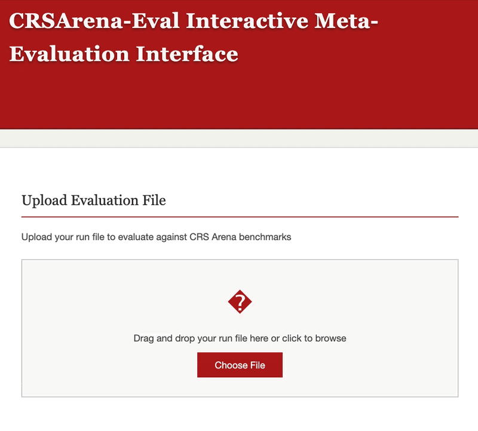

# Run File


This directory contains the run file of FACE, which is used to evaluate the performance against the CRSArena-Eval dataset.


## Run File Format

Single run file for all aspects.
The same format as CRSArena-Eval dataset, but with predicted scores instead of human annotations.
```python
[
  { # Conversation 1
    "conv_id": "string",  # Unique identifier for the conversation
    "turns": [           # List of turns in the conversation
      {
        "turn_ind": float,      # Index of the turn being evaluated (0-based)
        "turn_level_pred": { # Turn-level aspects
          "relevance": float,     # Relevance score (0-3)
          "interestingness": float # Interestingness score (0-2)
        }
      },
      # ... more turns
    ],
    "dial_level_pred": { # Dialogue-level aspects
      "understanding": float, # Understanding score (0-2)
      "task_completion": float, # Task Completion score (0-2)
      "interest_arousal": float, # Interest Arousal score (0-2)
      "efficiency": float,    # Efficiency score (0-2)
      "dialogue_overall": float # Overall Impression score (0-4)
    }
  # ... more conversations
  }
]
```

The evaluation script and interface also accept the legacy aliases `dialog_overall` and `overall_impression`.

## Evaluation

To evaluate the run file against the CRSArena-Eval dataset, use the provided evaluation script:

```bash
python eval.py --run_file path/to/run_file.json --eval_file path/to/crs_arena_eval.json
```

## Easy-to-Use Meta-Evaluation Interface

We provide an easy-to-use meta-evaluation interface to evaluate your evaluator against the CRSArena-Eval dataset.
See [`interface/README.md`](../../interface/README.md) for detailed instructions on how to run the interface locally.


