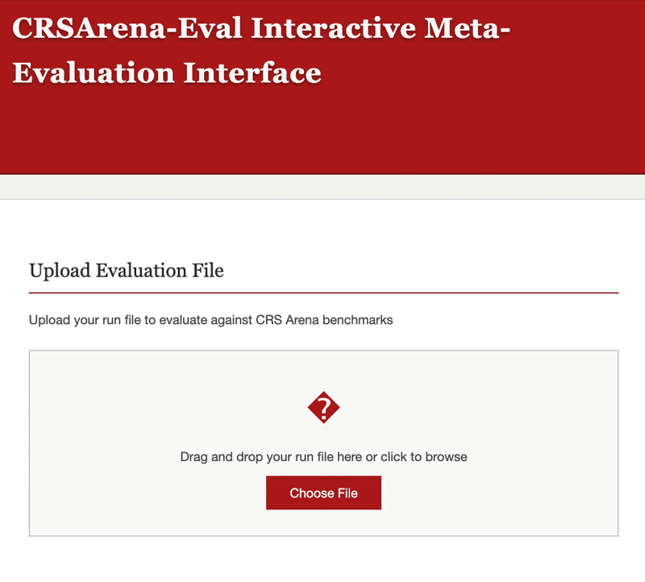

# CRSArena-Eval Meta-Evaluation Interface

An interactive web-based evaluation tool for CRS Arena benchmarks. Upload your run file and instantly see correlation metrics (Pearson & Spearman) for turn-level and dialogue-level aspects.

**Run locally:**

Navigate to the `meta_eval_interface` directory and start a simple HTTP server (CORS restrictions prevent direct file opening). Then open `http://localhost:8000` in your browser.

```bash
cd meta_eval_interface
python3 -m http.server 8000
```

The public interface is hosted at
[`https://informagi.github.io/face/meta_eval_interface/`](https://informagi.github.io/face/meta_eval_interface/).

For run file format, see: [`dataset/run/README.md`](../dataset/run/README.md)

## Demo


